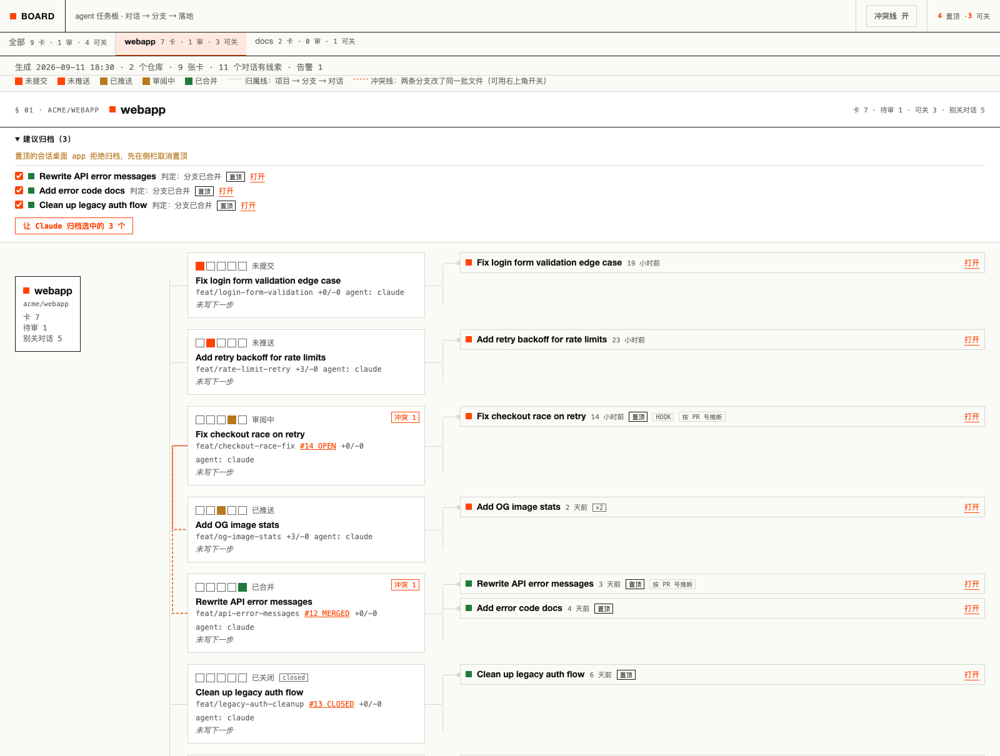
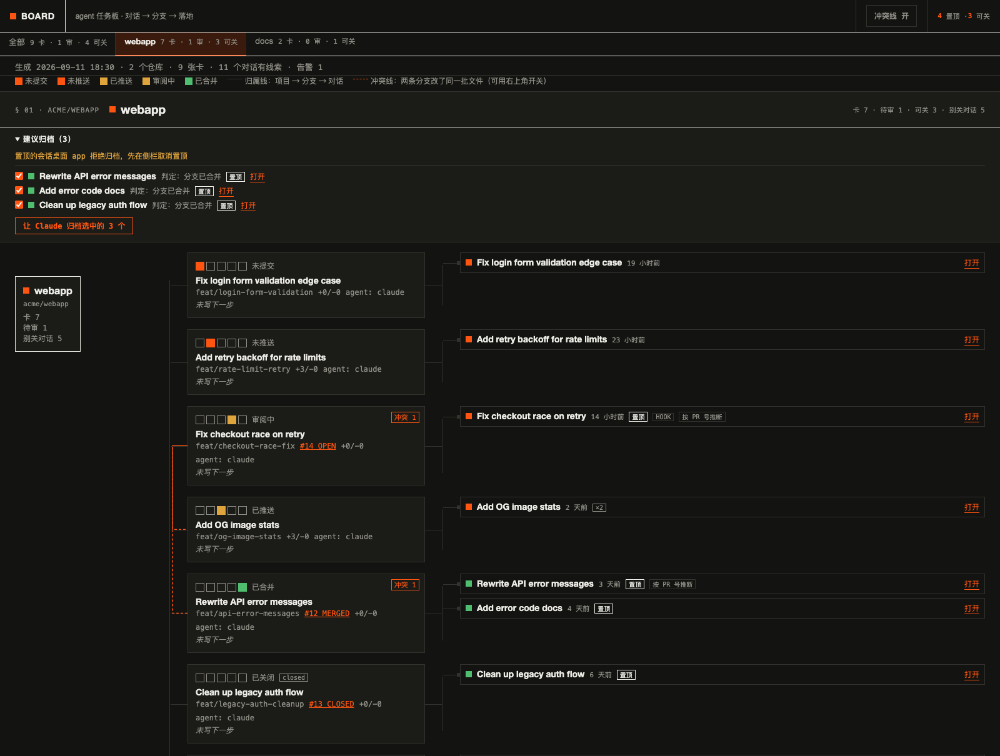

# carl-vibe-kanban

给 Claude Code 和 Codex 用户的一本账：每条分支一张 markdown 卡，状态从 git 和 GitHub 现场读，告诉你每个对话对应的分支推到哪一步、这个对话敢不敢关。不起 agent 进程，不内嵌终端，不要登录，没有服务端。

A local-only ledger for coding agents. One markdown card per branch, state read live from git and GitHub, so you always know where each conversation's branch stands and whether that conversation is safe to close. No agent runner, no embedded terminal, no login, no server.

```bash
git clone https://github.com/LearnPrompt/carl-vibe-kanban.git ~/projects/carl-vibe-kanban && cd ~/projects/carl-vibe-kanban && bash scripts/install.sh && board init
```



<details>
<summary>暗色 / dark mode</summary>



</details>

---

## 中文

### 它回答一个问题

你同时开着十几个 Claude Code 或 Codex 对话，每个对话开了一条甚至好几条分支。侧栏每个对话只记最后一个 PR，实际一个对话常碰十几条分支。于是你不敢关对话、不敢取消置顶，因为不确定里面的东西是不是都落地了。手写的进度文档一定会漂，因为没人会在每次合并后回去改它。

`board` 把这本账交给 git：branch、worktree、PR 状态、最近提交、ahead/behind、脏文件、未 push 的 commit、和别的分支撞了哪些文件，全部每次 `sync` 时重新推导。人只写三样：下一步做什么、验证证据在哪、派给了谁。

### 怎么工作

**卡片就是仓库里的文件。** 每个仓库有一个 `board/tasks/` 目录，一条分支一个 markdown，frontmatter 分派生区和人工区。任何 agent 用 `cat` 就能读，删掉整个 `board/` 目录对仓库零影响。

**对话和分支怎么对上。** 三条线索，优先级从高到低：

1. **hooks**。`board hooks install` 后，Claude Code 每次会话开始、每条消息、每次结束都把「哪个会话、在哪个目录、哪条分支」记进本地日志。发生的那一刻就写下，不用猜。
2. **转录**。扫描 `~/.claude/projects` 和 `~/.codex/sessions`，只从 agent 真实执行过的命令和你说的话里抽分支线索。工具输出和系统注入不算，会话标题不算，因为标题是 agent 随机起的。
3. **桌面 app 元数据**。在 Claude 桌面 app 里导出一次会话列表，得到置顶状态和 PR 号。PR 号只有在整个工作区里唯一时才认。

**三条进门的路。** CLI 是本体；`board mcp` 把同样的能力暴露成 MCP 工具，Claude Code 和 Codex 都能直接调；`skills/board/SKILL.md` 一份 skill 两边共用，告诉 agent 什么时候该记账。

**渲染是一页静态 HTML。** `board render --all` 生成一个文件，file:// 直接打开，零外部请求，暗色随系统。左边项目，中间分支带五格进度条，右边对话 chip 带结论，一行一分支对齐。冲突分支之间画虚线。每个仓有一块「建议归档」面板，点一下就能让 Claude 逐个归档。

### 五分钟上手

```bash
board init --repos ~/projects/foo,~/projects/bar   # 写 ~/.config/board/config.json
board sync --all                                   # 每个仓刷卡片，顺带扫对话转录
board render --all && open ~/.cache/board/index.html
board sessions ls --all --pinned                   # 置顶对话：分支、可关/别关/无线索 + 理由
board cleanup --all                                # 已合并却还留着 worktree 的分支，先看后删
```

可选的两步，装一次就行：

```bash
board hooks install    # Claude Code hooks 直写会话↔分支
board mcp install      # 注册 MCP 到 Claude Code 与 Codex
```

需要 Node 20 以上和 `gh` 命令行（读 PR 状态）。没有任何 npm 依赖。

### 命令

| 命令 | 做什么 |
|---|---|
| `sync [--all]` | 刷新派生字段，自动发现 worktree 和 open PR，增量扫描对话 |
| `ls [--all] [--repo x] [--json]` | 列卡片，含 stage、冲突、脏文件、未 push 数 |
| `sessions ls [--all] [--pinned] [--json]` | 列对话及结论 |
| `sessions judge [--ai]` | 归档建议：分支已落地、标题重复、长期没动；`--ai` 走 `claude -p` |
| `sessions import <json>` | 导入桌面 app 的会话列表（置顶、PR 号） |
| `next <id> "…"` / `evidence <id> …` / `pin <id> <status>` | 写人工字段 |
| `dispatch <branch> --agent claude` | 建 worktree、拷 `.env.local`、落卡，只打印启动命令 |
| `cleanup [--all] [--apply]` / `done <id>` | 删已合并分支的 worktree 和本地分支，脏文件或未 push 一律拒绝 |
| `render [--all]` | 生成静态页 |
| `hooks install` / `mcp install` | 接入 Claude Code 与 Codex |
| `import vibe-kanban` | 从 vibe-kanban 本地库导入任务 |

完整参数看 `board --help`。

### 一张卡长什么样

```yaml
---
id: T-3f9a1c
repo: webapp
title: "feat(og): share image reads live site stats"
branch: feat/og-stats
worktree: /Users/me/worktrees/webapp-og-stats
pr: 148
pr_state: OPEN
last_commit: 702a060
ahead: 6
behind: 75
stage: pr_open              # dirty | unpushed | pushed | pr_open | merged | closed | missing
status: review              # backlog | doing | review | blocked | done | dropped
conflicts_with: [docs/model-eval (1 files), feat/skill-cards (3 files)]
flags: [conflict, no_next_step]
agent: claude               # 人工
evidence: []                # 人工：PR 链接、截图路径、测试输出
next_step: ""               # 人工：唯一必填
---
（正文随便写，工具永远不碰）
```

上面除了最后三行，全部由 `sync` 覆盖。想锁住状态用 `board pin`。

### 判定规则

**分支的 stage**，命中即停：有未提交文件 → `dirty`；PR 已合并 → `merged`；PR 关闭未合 → `closed`；本地和远端都没这条分支 → `missing`；本地比远端多 commit → `unpushed`；PR 开着 → `pr_open`；其余 → `pushed`。脏文件排最前，因为 PR 合了但 worktree 还有改动的对话照样不能关。

**对话的结论**：碰过的分支全部 merged 或 closed 且 worktree 干净 → 可关；否则 → 别关，理由写明是哪条分支、差在哪；没碰过任何仓库的分支 → 无线索，通常是写作类对话。

**冲突**：活跃分支两两取相对主干的改动文件交集，非空就记在双方的 `conflicts_with` 里。

### 从 vibe-kanban 过来

名词对照：vibe-kanban 的 project 是这里的一个 repo；task 是一张 markdown 卡；workspace 或 attempt 是一条分支加一个 worktree；attempt 的状态是卡上的派生字段和证据行。

三处不一样，每处对应它 issue 里反复出现的问题：

vibe-kanban 把看板放在自己的数据库里，手动 checkout 它不认，外部开的 PR 它不识别，清掉 worktree 卡片会静默丢关联（#2655、#2629、#3329）。这里没有数据库，每次 `sync` 从 git 和 gh 重新推导，板子不可能和仓库对不上。

vibe-kanban 替你起 agent 进程，每家 CLI 改一次输出格式就要适配一次（三十多条适配 issue）。这里不起进程，任何能读写文件的 agent 第一天就能用。

vibe-kanban 从 0.1.9 起要登录才能看板（#2687）。这里是仓库里的一个 `board/` 文件夹，离线、内网、多机同步都靠 git。

它的现状：Bloop 于 2026 年 4 月关停，云端 5 月 10 日下线，官网域名 6 月过期。最后一个不登录就有本地看板的版本是 `npx vibe-kanban@0.1.8`；0.1.43 只有自托管服务端加本地 auth 才保留 projects。本项目不是它的 fork，没有共用代码，名字里带 vibe-kanban 是为了让找它替代品的人能找到这里。

#### 从 vibe-kanban 导入

```bash
board import vibe-kanban                        # 默认数据库路径，dry-run 预览要导入什么
board import vibe-kanban --apply                 # 实际写卡片
board import vibe-kanban ~/path/db.v2.sqlite --repo ~/projects/foo --apply   # 指定数据库和目标仓库
```

默认数据库路径：macOS `~/Library/Application Support/ai.bloop.vibe-kanban/db.v2.sqlite`；Linux 一般是 `~/.local/share/vibe-kanban/db.v2.sqlite`（尊重 `$XDG_DATA_HOME`）。老版本的库文件叫 `db.sqlite`，也认。

| vibe-kanban | board |
|---|---|
| project（按 git 仓库路径匹配 `workspace.repos`，匹配不到用 `--repo` 指定） | repo |
| task（title / description / status） | 卡片（title / body / status），`status_pinned: true` |
| todo / inprogress / inreview / done / cancelled | backlog / doing / review / done / dropped |
| 最新 attempt/workspace 的 branch（没有分支的 task 默认跳过，加 `--branchless` 一并导入） | `branch` |
| 关联的 PR | `evidence` 里追加一行 `PR #n <url> (<status>)` |

按 `vk:<task_id>` 作自然键，重复导入幂等：已存在的卡片只更新正文里的导入行，不覆盖你手改过的字段。导入后跑一次 `board sync` 把派生字段补全。

### 要求与边界

- Node 20 以上，`git`，`gh`（已登录）。macOS 和 Linux；Windows 未测。
- 桌面 app 的会话标题和置顶状态没有落盘接口，要在 app 里导出一次 JSON 再 `board sessions import`。部分会话 id 和转录文件名对不上，这些只能靠 PR 号推断，页面上有标注。
- 桌面 app 拒绝归档置顶会话，agent 也没有取消置顶的工具。流程是：板子给清单，你取消置顶，agent 归档。
- 各仓的 `board/` 目录要不要提交进 git 由你决定，工具不替你 commit。
- `dispatch` 默认只打印启动命令，`--run` 才真起 agent。`cleanup` 默认 dry-run，脏文件或未 push 一律拒绝，`--force` 才绕。

---

## English

### The one question it answers

You have a dozen Claude Code or Codex conversations open, each on one or several branches. The sidebar remembers one PR per conversation; in practice one conversation touches many branches. So you never close anything, because you cannot tell what landed. Hand-written status docs drift, since nobody updates them after every merge.

`board` hands the ledger to git. Branch, worktree, PR state, last commit, ahead/behind, dirty files, unpushed commits, and which files collide with other branches are all re-derived on every `sync`. Humans write three fields: next step, evidence, and who it was dispatched to.

### How it works

**Cards are files in your repo.** Each repo gets a `board/tasks/` folder, one markdown per branch, frontmatter split into a derived zone and a manual zone. Any agent can `cat` it. Deleting `board/` touches nothing else.

**Matching conversations to branches**, highest priority first:

1. **Hooks.** After `board hooks install`, Claude Code records session, cwd, and current branch on every session start, message, and stop. Written when it happens, no guessing.
2. **Transcripts.** Scans `~/.claude/projects` and `~/.codex/sessions`, taking branch clues only from commands the agent actually ran and text you actually typed. Tool output and injected system text do not count. Session titles never count; the agent invents them.
3. **Desktop app metadata.** Export the session list once from the Claude desktop app to get pinned state and PR numbers. A PR number is trusted only when it is unique across the whole workspace.

**Three doors.** The CLI is the core. `board mcp` exposes the same operations as MCP tools for Claude Code and Codex. One `skills/board/SKILL.md` serves both agents and tells them when to keep the ledger.

**The render is one static HTML file.** `board render --all` writes a single page that opens from `file://` with zero external requests and follows system dark mode. Projects on the left, branches with a five-step progress bar in the middle, conversation chips with verdicts on the right, one row per branch. Conflicting branches are joined by dashed lines. Each repo has an "archive suggestions" panel that hands the list to Claude to archive one by one.

### Five minutes

```bash
board init --repos ~/projects/foo,~/projects/bar
board sync --all
board render --all && open ~/.cache/board/index.html
board sessions ls --all --pinned
board cleanup --all
```

Optional, once:

```bash
board hooks install
board mcp install
```

Requires Node 20+ and the `gh` CLI. Zero npm dependencies.

### Commands

| Command | What it does |
|---|---|
| `sync [--all]` | Re-derive fields, discover worktrees and open PRs, incrementally scan transcripts |
| `ls [--all] [--repo x] [--json]` | List cards with stage, conflicts, dirty and unpushed counts |
| `sessions ls [--all] [--pinned] [--json]` | List conversations with verdicts |
| `sessions judge [--ai]` | Archive suggestions: landed, duplicate title, stale; `--ai` uses `claude -p` |
| `sessions import <json>` | Import the desktop app's session list |
| `next` / `evidence` / `pin` | Write the manual fields |
| `dispatch <branch> --agent claude` | Create worktree, copy `.env.local`, write the card, print the launch command |
| `cleanup [--all] [--apply]` / `done <id>` | Remove worktrees and local branches of merged work; refuses dirty or unpushed |
| `render [--all]` | Generate the page |
| `hooks install` / `mcp install` | Wire into Claude Code and Codex |
| `import vibe-kanban` | Import tasks from a local vibe-kanban database |

`board --help` lists every flag.

### Rules

**Branch stage**, first match wins: uncommitted files → `dirty`; PR merged → `merged`; PR closed unmerged → `closed`; branch gone locally and remotely → `missing`; local ahead of remote → `unpushed`; PR open → `pr_open`; else `pushed`. Dirty comes first because a merged PR with leftover edits still is not safe to close.

**Conversation verdict**: every touched branch merged or closed with a clean worktree → can close; otherwise → keep, with the branch and reason spelled out; no branch touched in any repo → no clue, usually a writing session.

**Conflicts**: pairwise intersection of files changed against the base branch, recorded on both cards.

### Coming from vibe-kanban

A project is a repo here, a task is a markdown card, a workspace/attempt is a branch plus a worktree, and attempt status is the card's derived fields and evidence lines. Three differences, each matching a recurring issue there: no database, so the board cannot drift from git (#2655, #2629, #3329); no agent runner, so nothing to adapt per CLI; no login, the board is a folder in your repo. Bloop shut down in April 2026, cloud went dark May 10, the domain expired in June. The board moved to the cloud in 0.1.9 (#2687); the last release with a local, no-login board is `npx vibe-kanban@0.1.8`. This is not a fork and shares no code.

#### Importing from vibe-kanban

```bash
board import vibe-kanban                        # default db path, dry-run preview
board import vibe-kanban --apply                 # actually write cards
board import vibe-kanban ~/path/db.v2.sqlite --repo ~/projects/foo --apply
```

Default database path: macOS `~/Library/Application Support/ai.bloop.vibe-kanban/db.v2.sqlite`; Linux `~/.local/share/vibe-kanban/db.v2.sqlite` (honors `$XDG_DATA_HOME`). Older `db.sqlite` files work too. Keyed by `vk:<task_id>`, so re-importing is idempotent and never overwrites hand-edited fields. Run `board sync` afterward.

### Requirements and limits

- Node 20+, `git`, `gh` logged in. macOS and Linux; Windows untested.
- The desktop app does not persist session titles or pinned state; export once and `board sessions import`. Sessions whose app id does not match a transcript are matched by unique PR number and labelled as such.
- The desktop app refuses to archive pinned sessions and agents cannot unpin. The flow is: the board gives you the list, you unpin, the agent archives.
- Whether to commit each repo's `board/` folder is your call; the tool never commits for you.
- `dispatch` only prints the launch command unless `--run`. `cleanup` is dry-run by default and refuses dirty or unpushed branches unless `--force`.

---

## 致谢 / Credits

方法论借鉴了 [Backlog.md](https://github.com/MrLesk/Backlog.md)（一任务一 markdown、可配置状态列、无服务可读的看板导出）和 [Beads](https://github.com/steveyegge/beads)（typed metadata、依赖关系与 ready/blocked 查询）。没有借它们的存储层和隐式安装动作。

Method borrowed from [Backlog.md](https://github.com/MrLesk/Backlog.md) (one markdown per task, configurable columns, serverless board export) and [Beads](https://github.com/steveyegge/beads) (typed metadata, dependencies, ready/blocked queries). Their storage layers and implicit install steps were deliberately left out.

MIT.
